# V16-RC5 Decision Flow

Meeting summary for the promoted executable in this folder: `main.py`.

## Why this is the working best submission

- `01_baseline3k` beat `00_baseline` **100–0**, with a mean final-money margin
  of **+17,172.08** over 100 two-seat games.
- The reconstructed production core supplies most of the gain: without the
  premium lead it still beat `00_baseline` **24–0**, at **+16,141.46** mean
  margin.
- The full agent beat its otherwise identical no-lead core **24–0**, at
  **+1,917.50** mean margin. The lead is mainly a close-match separator.

The strategy is therefore: keep the stable 8-cow/4-sheep production route,
protect it from narrow route drift, and move eligible premium sales one turn
earlier without increasing the planned two-turn sale quantity.

## Day-grouped actor flow

The executable contains exactly 720 scheduled steps: 30 days × 24 turns. One
central Python `agent` chooses the combined action; the main farmer, hired
hands, and market are action lanes, not independent decision-making agents.

Legend: **F** = main farmer, **H** = hired hands, **M** = market controller,
**W** = weed-recovery overlay, **P** = premium-sale timing overlay. Live hand
alignment and the safe fallback apply on every day.

```mermaid
flowchart TB
    START([Season starts]) --> S0

    subgraph P0["Day 0 — Bootstrap"]
        direction TB
        S0["Execute opening trace"]
        S0 --> F0["Main farmer<br/>Build one pasture and place the cow<br/>Pick up feed; anchor feed and care"]
        S0 --> H0["Hired hands<br/>Build four pastures and place four sheep<br/>Plant five melon and five wheat; water and care"]
        S0 --> M0["Market<br/>Buy 1 cow, 4 sheep, seeds and wheat<br/>Hire five hands; make opening wheat sale"]
        F0 --> A0{"Adaptive overlay<br/>W: dig a blocking weed and start replay"}
        H0 --> A0
        M0 --> A0
    end

    A0 --> S12

    subgraph P12["Days 1–2 — Stabilize"]
        direction TB
        S12["Run early maintenance trace"]
        S12 --> F12["Main farmer<br/>Care, water, feed, collect fertilizer and pick up"]
        S12 --> H12["Hired hands<br/>Support care, water, feed and collection"]
        S12 --> M12["Market<br/>Hire lightly, buy wheat feed<br/>Begin fertilizer sales"]
        F12 --> A12{"Adaptive overlay<br/>Day 1: W replay may arrive from day 0<br/>Day 2: no W or P window"}
        H12 --> A12
        M12 --> A12
    end

    A12 --> S35

    subgraph P35["Days 3–5 — Add crops and second cow"]
        direction TB
        S35["Expand the first production block"]
        S35 --> F35["Main farmer<br/>Anchor animal maintenance<br/>Build pasture and place second cow on day 5"]
        S35 --> H35["Hired hands<br/>Plant strawberry and wheat<br/>Water, feed, collect and begin harvesting"]
        S35 --> M35["Market<br/>Buy second cow, seeds and feed<br/>Hire hands and sell fertilizer"]
        F35 --> A35{"Adaptive overlay<br/>W trigger and replay on days 3–5<br/>No P window"}
        H35 --> A35
        M35 --> A35
    end

    A35 --> S68

    subgraph P68["Days 6–8 — Scale to 8 cows and 4 sheep"]
        direction TB
        S68["Build the full livestock route"]
        S68 --> F68["Main farmer<br/>Continue livestock maintenance<br/>Handle part of the cattle setup"]
        S68 --> H68["Hired hands<br/>Build and place remaining cattle pastures<br/>Scale planting and watering"]
        S68 --> M68["Market<br/>Unlock land on day 6; buy six cows<br/>Buy seed/feed; sell fertilizer, wheat and wool"]
        F68 --> A68{"Adaptive overlay<br/>W trigger and replay on days 6–8<br/>P move on day 6; subtraction may alter day 7<br/>No P window on day 8"}
        H68 --> A68
        M68 --> A68
    end

    A68 --> S910

    subgraph P910["Days 9–10 — Full-farm ramp"]
        direction TB
        S910["Ramp the 12-animal farm"]
        S910 --> F910["Main farmer<br/>Maintain livestock<br/>Handle a small share of planting and watering"]
        S910 --> H910["Hired hands<br/>Run bulk care, watering, planting and harvesting"]
        S910 --> M910["Market<br/>Scale hires and sales<br/>Unlock third quadrant; buy melon/strawberry batch"]
        F910 --> A910{"Adaptive overlay<br/>W trigger/replay and P move/subtraction<br/>on both days"}
        H910 --> A910
        M910 --> A910
    end

    A910 --> S1115

    subgraph P1115["Days 11–15 — Stable production"]
        direction TB
        S1115["Run the steady production loop"]
        S1115 --> F1115["Main farmer<br/>Anchor feed, care and fertilizer collection<br/>Perform limited crop work"]
        S1115 --> H1115["Hired hands<br/>Perform most watering, harvesting, planting<br/>and fertilizer application"]
        S1115 --> M1115["Market<br/>Hire, buy wheat/feed and release scheduled<br/>fertilizer, milk, wheat and wool batches"]
        F1115 --> A1115{"Adaptive overlay<br/>W triggers: days 11–13 and 15<br/>W replay-only possibility: day 14<br/>P: days 12–15; none on day 11"}
        H1115 --> A1115
        M1115 --> A1115
    end

    A1115 --> S1619

    subgraph P1619["Days 16–19 — High throughput"]
        direction TB
        S1619["Increase crop and sale throughput"]
        S1619 --> F1619["Main farmer<br/>Continue animal maintenance<br/>Perform limited watering and harvesting"]
        S1619 --> H1619["Hired hands<br/>Water, fertilize, harvest, replant<br/>and move inventory"]
        S1619 --> M1619["Market<br/>Hire, replenish feed/seed and sell<br/>premium and staple product waves"]
        F1619 --> A1619{"Adaptive overlay<br/>W triggers: days 16, 17 and 19<br/>W replay-only possibility: day 18<br/>P: every day"}
        H1619 --> A1619
        M1619 --> A1619
    end

    A1619 --> S2023

    subgraph P2023["Days 20–23 — Peak production"]
        direction TB
        S2023["Harvest and convert at peak volume"]
        S2023 --> F2023["Main farmer<br/>Maintain animals<br/>Perform limited wheat replant, dig and harvest"]
        S2023 --> H2023["Hired hands<br/>Peak harvest and fertilization<br/>Shift planting toward wheat; drop inventory"]
        S2023 --> M2023["Market<br/>Hire heavily; buy wheat seed/feed<br/>Run largest melon, strawberry and milk waves"]
        F2023 --> A2023{"Adaptive overlay<br/>W trigger/replay and P move/subtraction<br/>on every day"}
        H2023 --> A2023
        M2023 --> A2023
    end

    A2023 --> S2427

    subgraph P2427["Days 24–27 — Late-season conversion"]
        direction TB
        S2427["Convert production into cash"]
        S2427 --> F2427["Main farmer<br/>Continue maintenance, watering and harvesting"]
        S2427 --> H2427["Hired hands<br/>Run late wheat loop, harvest, dig spent tiles<br/>and drop inventory"]
        S2427 --> M2427["Market<br/>Buy remaining wheat seed/feed<br/>Progressively liquidate all product classes"]
        F2427 --> A2427{"Adaptive overlay<br/>W triggers: days 24–26<br/>W replay-only possibility: day 27<br/>P: every day"}
        H2427 --> A2427
        M2427 --> A2427
    end

    A2427 --> S28

    subgraph P28["Day 28 — Wind down"]
        direction TB
        S28["Reduce field investment"]
        S28 --> F28["Main farmer<br/>Care, collect fertilizer and water"]
        S28 --> H28["Hired hands<br/>Harvest, water and finish limited maintenance"]
        S28 --> M28["Market<br/>Hire and accelerate fertilizer, milk,<br/>wheat and wool sales"]
        F28 --> A28{"Adaptive overlay<br/>P only; no W window"}
        H28 --> A28
        M28 --> A28
    end

    A28 --> S29

    subgraph P29["Day 29 — Final liquidation"]
        direction TB
        S29["Convert remaining output before season end"]
        S29 --> F29["Main farmer<br/>Harvest, water and drop inventory"]
        S29 --> H29["Hired hands<br/>Harvest, drop inventory and make final collections"]
        S29 --> M29["Market<br/>Hire scheduled hands and sell remaining<br/>fertilizer, milk, strawberry and wheat"]
        F29 --> A29{"Adaptive overlay<br/>P only; no W window"}
        H29 --> A29
        M29 --> A29
    end

    A29 --> END([Season complete])
```



### What adaptation actually means

The embedded 720-step trace remains the default plan. An overlay reads the live
observation and conditionally modifies a narrow part of the current scheduled
action; it does not replace the production route.

#### W — weed-recovery overlay

**Purpose:** prevent a randomly spawned weed from permanently breaking a
critical scripted `PLANT` or `BUILD_PASTURE` sequence.

The overlay activates only when both conditions are true:

1. The current scheduled action for the farmer or a hired hand is `PLANT` or
   `BUILD_PASTURE`.
2. The live tile under that actor is a weed.

The recovery sequence is:

```text
Scheduled PLANT or BUILD_PASTURE
        ↓
Live tile is a weed?
        ├─ No  → execute the scheduled action
        └─ Yes → execute DIG and record the interrupted action
                         ↓
                 Next turn: retry the interrupted action
                         ↓
                 Replay that actor's displaced trace
                 for up to eight additional turns
                         ↓
                 Rejoin the normal fixed schedule
```

For example, if a hand is scheduled to `PLANT WHEAT` but stands on a weed, the
hand uses `DIG` now and retries `PLANT WHEAT` next turn. On the following turns,
that hand receives the preceding scheduled actions so its route stays one turn
behind temporarily. After the replay window, it rejoins the current trace.

The recovery state is tracked separately for each player seat and each affected
actor. A late-day trigger can make the next day a replay-only adaptive day.

**Limits:** W does not repair missed purchases, missing animals, incorrect
positions, failed feeding, arbitrary route drift, or weeds blocking actions
other than `PLANT` and `BUILD_PASTURE`.

#### P — premium-sale timing overlay

**Purpose:** obtain an earlier position in the shared market queue by moving an
eligible premium sale forward by one turn without increasing the intended
two-turn sale quantity.

P applies only to:

- `MELON`
- `MILK`
- `STRAWBERRY`
- `WOOL`

For each product, the overlay first checks whether the next trace step contains
a scheduled sale. It moves part of that sale to the current turn only when:

1. The next turn has a positive scheduled sale quantity for that product.
2. The current turn has no matching town demand.
3. The live shed contains stock after reserving quantities needed by current
   pickups and existing sales.
4. The current market list has a free slot, or already contains a sale for the
   same product.

The moved quantity is the smaller of the next-turn scheduled quantity and the
unreserved live stock. The overlay merges it into an existing sale or appends a
new order, while preserving the 10-order market limit. It records the moved
amount and subtracts exactly that quantity from the next turn's scheduled sale.

```text
Original schedule
Turn 99: no MILK sale
Turn 100: SELL 20 MILK

Possible P adjustment
Turn 99: SELL 12 MILK early
Turn 100: SELL 8 MILK

Total intended volume remains 20 MILK.
```

If stock is unavailable, town demand is active, no eligible sale exists next
turn, or the market list is full without an existing sale for that product, P
leaves the schedule unchanged.

**Limits:** P does not change production, purchases, hiring, crop choice, or
the total planned two-turn sale quantity. It changes timing only, and only for
the four listed premium products.

#### Always-on alignment and fallback

On every day, the returned hand-action list is padded with `PASS` or truncated
to match the live number of hired hands. If any unexpected exception occurs,
the agent returns `PASS` for the farmer and every live hand, with no market
orders.

Crop choice, animal and land purchases, hiring, normal feed/care/collect
decisions, harvest timing, movement, and ordinary sales remain scripted.

## Environment-alignment rules

1. The step is clamped to the embedded trace, so indexing remains valid.
2. Hand actions are padded with `PASS` or truncated to the live hand count both
   before recovery logic and before return.
3. Weed recovery changes only a blocked scheduled `PLANT` or
   `BUILD_PASTURE`; it then replays the displaced actor schedule.
4. Premium front-running uses live shed stock, preserves current pickups and
   sales, skips turns with matching town demand, and removes the moved quantity
   from the next scheduled sale.
5. Market output is capped at 10 orders. Any unexpected exception returns a
   schema-valid all-`PASS` field action and an empty market list.

## Fresh smoke validation

Run on 2026-08-19 with `kaggle-environments==1.32.7`, using the built-in
`starter` opponent and one game in each candidate seat:

- Candidate in seat 0: 720 frames, `DONE / DONE`, hand alignment passed on all
  719 calls, and the market-order cap passed.
- Candidate in seat 1: 720 frames, `DONE / DONE`, hand alignment passed on all
  719 calls, and the market-order cap passed.

This is an execution-alignment smoke test, not a new strength benchmark. The
strength results above come from the recorded canonical and ablation panels in
`BENCHMARK_FINDINGS.md`.
