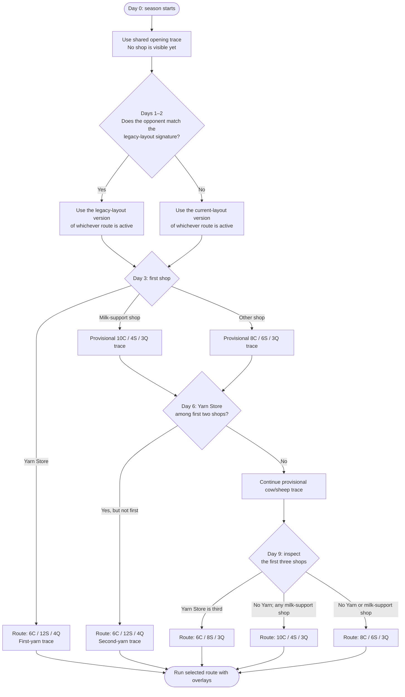

# V20-Adaptive-R1 Multi-Route Decision Flow

Meeting summary for the executable in this folder: `main.py`.

This is a **multi-route agent**. One central Python `agent` reads the live
observation, chooses one of five season traces, and then applies narrow
observation-driven overlays. The main farmer, hired hands, and market are
action lanes controlled by that agent; they are not independent policies.

The five strategic routes are:

- `10c4s_3q`: 10 cows, 4 sheep, 3 quadrants.
- `8c6s_3q`: 8 cows, 6 sheep, 3 quadrants.
- `6c8s_3q`: 6 cows, 8 sheep, 3 quadrants.
- `6c12s_4q_first_yarn`: 6 cows, 12 sheep, 4 quadrants when Yarn Store is
  the first unlocked shop.
- `6c12s_4q_second_yarn`: 6 cows, 12 sheep, 4 quadrants when Yarn Store is
  the second unlocked shop.

Each route has both a current-layout trace and a legacy-layout trace. This
gives ten executable traces in total, each containing 719 scheduled actions
for environment steps 0–718.

## Live route-selection flow

Route selection is not a one-time Day 0 decision. The agent re-evaluates the
ordered `town.unlocked_shops` list on every call. With the default three-day
shop-unlock interval, the useful checkpoints are Days 3, 6, and 9.



Milk-support shops are `PIZZA_SHOP`, `ICE_CREAM_SHOP`, and
`SMOOTHIE_SHOP`. The first-yarn test has highest priority, followed by Yarn
in the first two, Yarn in the first three, milk support, and finally the
8C/6S default.

The legacy-layout choice is independent of the livestock route. It is decided
per player seat during Days 1–2 and remains sticky for the rest of the season.
It activates only for the exact observed opponent signature of 5 wheat,
5 melon, 1 cow, 4 sheep, no empty pasture, and at most 12 money.

## Day-grouped multi-route actor flow

Legend: **F** = main farmer, **H** = hired hands, **M** = market controller.
The route can change at a shop checkpoint; overlays shown later can modify the
active trace without selecting a different livestock route.

```mermaid
flowchart TB
    S([Season starts]) --> D0

    subgraph OPEN["Shared opening"]
        direction TB
        D0["Day 0 — Bootstrap<br/><br/>F: build pasture, place livestock, anchor feed/care<br/>H: establish pasture and crop work<br/>M: hire 5; buy 2C, 2S, wheat and melon inputs"]
        D0 --> D12["Days 1–2 — Stabilize and inspect layout<br/><br/>F: feed, care, collect and move stock<br/>H: water, feed and maintain the opening grid<br/>M: buy feed, sell fertilizer and add hands<br/>Adaptive choice: current or legacy layout"]
    end

    D12 --> Q1{"Day 3<br/>First shop?"}

    Q1 -->|Yarn first| Y135
    Y135["First-yarn route · Days 3–5<br/><br/>F/H: continue animal and crop setup<br/>M: grow toward 4C / 2S; add strawberry<br/>Route is now stable"]
    Y135 --> Y168["Days 6–8<br/><br/>F/H: open land and expand the pasture grid<br/>M: reach 6C / 4S; buy first extra quadrant<br/>Scale strawberry, wheat and carrot work"]
    Y168 --> Y1910["Days 9–10<br/><br/>F/H: increase sheep care and crop throughput<br/>M: reach 6C / 6S; run the first large melon wave"]
    Y1910 --> Y1115["Days 11–15<br/><br/>F/H: fill and operate the four-quadrant layout<br/>M: add 2S on Days 11, 12 and 13<br/>Finish at 6C / 12S / 4Q"]
    Y1115 --> Y1623["Days 16–23<br/><br/>F: anchor livestock maintenance<br/>H: bulk water, harvest, replant and drop stock<br/>M: emphasize wool plus crop/fertilizer sales"]
    Y1623 --> Y2427["Days 24–27<br/><br/>F/H: late wheat loop and inventory movement<br/>M: convert wool, wheat, strawberry and fertilizer"]
    Y2427 --> Y2829["Days 28–29<br/><br/>F/H: wind down field work and return stock<br/>M: accelerate sales, then liquidate leftovers"]

    Q1 -->|Not Yarn| P35
    P35["Days 3–5 — Provisional non-Yarn route<br/><br/>F/H: add crop blocks and maintain livestock<br/>M: use 10C/4S if first shop supports milk;<br/>otherwise use 8C/6S"]
    P35 --> Q2{"Day 6<br/>Yarn second?"}

    Q2 -->|Yes| Y268
    Y268["Second-yarn route · Days 6–8<br/><br/>F/H: join the Yarn-specific four-quadrant trace<br/>M: buy land and reach 6C / 4S;<br/>use the second-Yarn crop layout"]
    Y268 --> Y2910["Days 9–10<br/><br/>F/H: expand sheep and crop operations<br/>M: reach 6C / 6S; run melon and fertilizer waves"]
    Y2910 --> Y21115["Days 11–15<br/><br/>F/H: complete the four-quadrant sheep grid<br/>M: add 2S on Days 11, 12 and 13<br/>Finish at 6C / 12S / 4Q"]
    Y21115 --> Y21623["Days 16–23<br/><br/>F: anchor livestock maintenance<br/>H: bulk crop, fertilizer and inventory work<br/>M: balance wool, wheat, strawberry and melon sales"]
    Y21623 --> Y22427["Days 24–27<br/><br/>F/H: late harvest, wheat and drop cycles<br/>M: convert remaining high-volume output"]
    Y22427 --> Y22829["Days 28–29<br/><br/>F/H: wind down and return stock<br/>M: accelerate sales, then liquidate leftovers"]

    Q2 -->|No| P68
    P68["Days 6–8 — Continue provisional route<br/><br/>F/H: open land, expand pastures and crops<br/>M: reach 6C / 4S and build sale capacity"]
    P68 --> Q3{"Day 9<br/>Third-shop result?"}

    Q3 -->|Yarn third| S8910
    S8910["6C / 8S / 3Q · Days 9–10<br/><br/>F/H: pivot the new pasture work toward sheep<br/>M: add 2S on Day 9; run the Day-10 melon wave"]
    S8910 --> S81115["Days 11–15<br/><br/>F/H: stabilize the sheep-heavy three-quadrant grid<br/>M: add 2S on Day 11; finish at 6C / 8S"]
    S81115 --> S81623["Days 16–23<br/><br/>F: anchor livestock maintenance<br/>H: bulk crop and wool-production work<br/>M: sell wool, milk, crops and fertilizer in waves"]
    S81623 --> S82427["Days 24–27<br/><br/>F/H: late wheat, harvest and inventory cycles<br/>M: progressively convert all product classes"]
    S82427 --> S82829["Days 28–29<br/><br/>F/H: wind down and return stock<br/>M: accelerate sales, then liquidate leftovers"]

    Q3 -->|Milk support; no Yarn| C10910
    C10910["10C / 4S / 3Q · Days 9–10<br/><br/>F/H: keep the cattle-oriented pasture layout<br/>M: add 2C on Day 9; run the Day-10 melon wave"]
    C10910 --> C101115["Days 11–15<br/><br/>F/H: stabilize the milk-heavy three-quadrant grid<br/>M: add 2C on Day 11; finish at 10C / 4S"]
    C101115 --> C101623["Days 16–23<br/><br/>F: anchor cattle care and feed<br/>H: bulk crops, fertilizer and inventory work<br/>M: emphasize milk plus premium crop sales"]
    C101623 --> C102427["Days 24–27<br/><br/>F/H: late wheat, harvest and inventory cycles<br/>M: progressively convert all product classes"]
    C102427 --> C102829["Days 28–29<br/><br/>F/H: wind down and return stock<br/>M: accelerate sales, then liquidate leftovers"]

    Q3 -->|No Yarn or milk support| C8910
    C8910["8C / 6S / 3Q · Days 9–10<br/><br/>F/H: retain the balanced pasture layout<br/>M: add 2C on Day 9; run the Day-10 melon wave"]
    C8910 --> C81115["Days 11–15<br/><br/>F/H: stabilize the balanced three-quadrant grid<br/>M: add 2S on Day 11; finish at 8C / 6S"]
    C81115 --> C81623["Days 16–23<br/><br/>F: anchor mixed livestock maintenance<br/>H: bulk crop, fertilizer and inventory work<br/>M: balance milk, wool and premium crop sales"]
    C81623 --> C82427["Days 24–27<br/><br/>F/H: late wheat, harvest and inventory cycles<br/>M: progressively convert all product classes"]
    C82427 --> C82829["Days 28–29<br/><br/>F/H: wind down and return stock<br/>M: accelerate sales, then liquidate leftovers"]

    Y2829 --> E([Season complete])
    Y22829 --> E
    S82829 --> E
    C102829 --> E
    C82829 --> E
```



## When the live action can adapt

The selected current/legacy route supplies the default action. The runtime then
applies the following overlays in order.

```mermaid
flowchart LR
    TRACE["Selected route action"] --> W["W · Weed recovery<br/>Possible Days 0–28"]
    W --> G0["Feed guard<br/>Inactive in this build"]
    G0 --> EVAC["G · Late room evacuation<br/>Days 27–29, hours 21–23"]
    EVAC --> REPAY["P repayment<br/>Possible through Day 28"]
    REPAY --> RANK["S · Rank sell slots<br/>Any day with 2+ sales"]
    RANK --> P["P · Clone premium preemption<br/>Candidate Days 6 and 8–27"]
    P --> R5["R5 · Sheep-heavy opponent counter<br/>Candidate Days 6 and 9–29"]
    R5 --> MD["MD · Cow-heavy opponent counter<br/>Candidate Days 8–29"]
    MD --> ROOM["G · End-of-day room guard<br/>Every Day at hour 23 if needed"]
    ROOM --> T["T · Terminal liquidation<br/>Day 29, hours 20–23"]
    T --> ALIGN["Align hands to live environment<br/>Return safe fallback on exception"]
```



These are **possible** adaptation days, not guaranteed activations. Live weeds,
opponent shape, stock, town demand, clone distance, market slots, and projected
storage determine whether an overlay actually changes the scheduled action.

### W — weed-recovery overlay

W protects a scheduled `PLANT` or `BUILD_PASTURE` from a weed on the actor's
live tile:

```text
Scheduled PLANT or BUILD_PASTURE
        ↓
Weed under that actor?
        ├─ No  → keep the route action
        └─ Yes → DIG now
                   ↓
                retry the interrupted action next turn
                   ↓
                replay that actor's displaced route actions
                for up to eight more turns
                   ↓
                rejoin the active route trace
```

New W triggers are scheduled on Days 0, 2, and most Days 4–27. Days 1, 3, and
28 can be changed by replay from the previous day. On the second-yarn route,
Day 9 is also replay-only. W state is separate for each seat and actor.

W does not choose a different livestock route or repair failed purchases,
missing animals, feeding errors, or arbitrary positional drift.

### P — clone premium-sale preemption

P applies only to `STRAWBERRY`, `MELON`, `MILK`, and `WOOL`. It is designed for
a close public-state clone: the opponent's public farm signature must be within
distance 6 of the agent's signature.

When the next trace step contains a premium sale of at least four units, P can
move up to 12 available units one turn earlier. It reserves current pickups and
existing sales, requires market-order room, records the moved quantity, and
subtracts exactly that quantity from the next step.

```text
Next-step premium sale + close-clone opponent + live stock
        ↓
Move at most 12 units into the current market action
        ↓
Next step: remove exactly the quantity moved early
```

The candidate move days are Day 6 and Days 8–27. Repayment can affect Day 28.
Unlike the earlier baseline overlay, this build does not gate the move on town
demand, and its configured price-ratio floor is zero.

### R5 — sheep-heavy opponent sale counter

From Day 1 onward, the agent can classify an opponent as R5-family when the
opponent reaches at least four sheep and no more than three cows. The
classification is sticky for that seat.

On candidate Days 6 and 9–29, the overlay looks three turns ahead in its R5
reference market trace. If a premium sale is expected and neither the current
nor next step has matching town demand, it adds up to 50% of that reference
sale using unreserved shed stock. This is an extra counter-sale, so it is not
repaid on the next turn.

### MD — cow-heavy opponent sale counter

Detection begins at step 160, late on Day 6. An opponent is classified as
MD-family when it has either:

- at least two quadrants, at least four cows, and at most two sheep; or
- at least nine cows.

On candidate Days 8–29, the overlay looks one turn ahead in its MD reference
market trace and may add up to twice the referenced premium quantity, bounded
by unreserved live shed stock and the ten-order market cap. This classification
is also sticky, and the extra sale is not repaid.

### S, G, and T — sale order, storage, and season-end guards

- **S — sell-slot ranking:** when a market action has multiple sells, sell
  orders are reordered by estimated price impact and town-demand urgency.
  Non-sell orders keep their original slots.
- **G — room guard:** at hour 23 every day, the agent projects shed, carried
  stock, production, consumption, buys, and valid sells. If the 100-unit
  capacity would be exceeded, it appends priority sales when slots and stock
  allow. On Days 27–29 it can also redirect a nearby idle actor to the shed at
  hours 21–23 so carried saleable stock can be dropped and sold.
- **T — terminal liquidation:** from step 716, Day 29 hour 20, the agent adds
  sales for remaining sellable shed inventory. From step 718 it attempts to
  sell all available quantities, subject to the ten-order limit.

The feed-rescue function exists in the source but is disabled in this build;
it does not adapt any action.

## Environment-alignment rules

1. Route selection reads only the live ordered shop list and is re-evaluated
   before retrieving the current scheduled action.
2. The current/legacy layout choice is stored separately for each player seat.
3. Step indexing is clamped to the selected 719-action trace.
4. Hand actions are padded with `PASS` or truncated to the live hand count
   before recovery logic and again before return.
5. All overlays reserve required live stock where applicable and preserve the
   maximum of ten market orders.
6. Any unexpected exception returns `PASS` for the farmer and every live hand,
   with an empty market list.

## Fresh validation

This document describes the executable behavior; it does not invent a strength
benchmark. The notebook in this folder reconstructs and packages the standalone
agent but intentionally does not include a broad benchmark gallery.

Run on 2026-08-19 with the repository environment,
`kaggle-environments==1.32.7`, seed `20260820`, and the built-in `starter`
opponent:

- Candidate in seat 0: 720 frames, `DONE / DONE`, 719 candidate calls, live
  hand alignment passed on every call, and the market-order cap passed.
- Candidate in seat 1: 720 frames, `DONE / DONE`, 719 candidate calls, live
  hand alignment passed on every call, and the market-order cap passed.
- The seed exposed Yarn Store first, so both live runs selected the
  `6c12s_4q_first_yarn` route on Day 3 and retained it through Day 29.
- Static schema validation passed for all ten embedded traces: five route
  choices × current/legacy layout, each with 719 actions.

This is an execution-alignment smoke test, not a new strength benchmark. The
live runs exercise one route selected by that seed; the ten-trace check verifies
the shape and market-order limit of every embedded route artifact.
